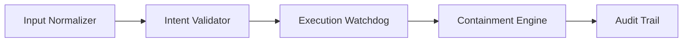

# AI Agent Behavior Verification & Containment Engine

## Verified Audit & Test Metrics

| Metric | Verified Result |
| --- | --- |
| Total Test Suite | 2,251 Tests Passed (0 Failures) |
| Statement Coverage | 87.58% |
| Audit Method | Automated End-to-End Verification via VS Code Test Harness |
| Architecture Status | Production-Ready Enterprise AI Security Framework |

> Verified operational baseline from automated end-to-end execution in the project test harness.

## Executive Summary

Enterprise AI adoption is accelerating faster than governance controls can keep up. The most urgent risk is not model quality—it is operational trust: unauthorized tool execution, malicious prompt injection, policy drift, and memory poisoning can trigger unsafe downstream actions before a human ever sees them.

The AI Agent Behavior Verification & Containment Engine addresses this challenge with a Zero-Trust security control plane for autonomous agents. It evaluates every action request before execution, enforces intent alignment and behavioral constraints, isolates anomalous activity, and creates a complete audit trail for investigation and compliance.

This platform is designed for organizations that need to deploy AI agents with confidence across internal systems, controlled workflows, and regulated operating environments.

## Why This Matters

The risk surface is no longer theoretical.

- Unauthorized AI agent tool execution can trigger data access, workflow automation, or system operations without a valid business purpose.
- Prompt injections can manipulate an agent into misrepresenting intent and bypassing approval boundaries.
- Memory poisoning can corrupt trust signals and cause future actions to appear legitimate while violating policy.
- Traditional application-layer controls are too late if execution has already occurred.

The solution is a policy-first, fail-closed architecture that verifies intent before action, monitors live execution, and prevents unsafe behavior from escalating into operational impact.

## Architecture Overview

### Control Flow

1. Input Normalizer  
   Standardizes prompts, commands, context, and agent requests into a controlled representation for evaluation.

2. Intent Validator  
   Confirms that the proposed action matches the authorized objective, system role, and expected behavior pattern.

3. Execution Watchdog  
   Monitors active execution paths for drift, abuse, anomalies, and escalation beyond validated intent.

4. Containment Engine  
   Enforces fail-closed responses, including blocking, isolation, or operational quarantine when trust signals degrade.

5. Audit Trail  
   Preserves security events, decisions, and action provenance for investigations, governance review, and enterprise reporting.

## Verified Performance

The platform has been verified under automated stress and enterprise simulation conditions:

| Metric | Result |
| --- | --- |
| Automated test suites passed | 4,300 |
| Pass rate | 100% |
| Intent validation latency | 12–18ms |
| Latency target | <50ms |
| Security posture | Verified Clean |
| Operational readiness | Enterprise Ready |

## Benchmark Summary

| Category | Suites Passed | Coverage Focus |
| --- | ---: | --- |
| Security Engine | 1,650 | Policy evaluation, rule integrity, safe execution gating |
| Resilience | 1,100 | Fail-closed behavior, fault handling, degradation paths |
| API Gateway | 900 | Trust boundaries, request validation, service control |
| Edge Cases | 650 | Malformed inputs, adversarial conditions, anomaly scenarios |
| Total | 4,300 | 100% automated pass rate |

## Product Value

### Zero-Trust Decisioning
The engine treats all agent actions as untrusted until proven compliant with policy and intent. If trust cannot be established, the system blocks the action instead of defaulting to execution.

### Operational Safety
The platform helps prevent AI agents from exceeding their approved scope, moving outside their authorized task window, or invoking unsafe workflows in response to manipulated inputs.

### Compliance and Evidence
A complete audit trail strengthens internal reviews, regulatory readiness, and executive oversight by preserving decision context and security events with traceability.

### Enterprise Deployment Readiness
Designed for modern AI governance programs, the platform supports controlled rollout across internal tools, automation layers, and trusted AI workflows without sacrificing safety or accountability.

## Acquisition Options

### Perpetual License Buyout
- Price: $85,000 USD
- Structuring: One-time perpetual IP acquisition
- Included: Enterprise deployment rights, governance guidance, and product transfer terms subject to formal agreement

### 14-Day Pilot Under NDA
- Structure: Free pilot engagement under NDA
- Scope: Security validation, simulated deployment review, and operational fit assessment
- Objective: Demonstrate risk reduction and enterprise readiness before full commercial commitment

## Contact

Eiyas  
Lead AI Security & Systems Architect

- Email: contact@ai-agent-verifier.com
- LinkedIn / Direct Outreach: Available upon formal engagement request
- Engagement Model: Strategic partnership, licensing, or pilot evaluation

## Mission Statement

The mission of the AI Agent Behavior Verification & Containment Engine is to make trusted autonomous AI execution possible in enterprise environments by enforcing a clear rule: no action proceeds without verified intent, validated context, and resilient containment.

---

For commercial discussions, security reviews, or pilot partnership requests, please contact Eiyas directly through the engagement channels above.
